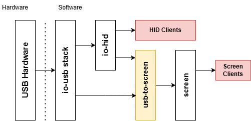

# usb-to-screen Version 2

usb-to-screen is a QNX 8.0 OS driver built to monitor USB devices and HID compliant controllers and pump their events to the `screen` subsystem.

This was originaly written for our version of RetroPie, as the QNXE quickstart image does not provide many gamepad related inputs to the `screen` system by default.

## Build & Use Instructions

Dependencies for this driver are generally included in a baseline SDP installation. Install your QNX SDP of choice (some version of QNX 8.0) or use one you already have installed - If you do not have a QNX License, you can get a free, noncommerical "QNXEverywhere" License here: https://www.qnx.com/products/everywhere/ (This is a version of QNX 8 which is intended for hobbyist or research purposes).

Once you have a baseline installed, simply source and run make as you would any project.
```bash
source ~/path/to/qnx800/qnxsdp-env.sh
cd ~/path/to/usb-to-screen
make
```
This uses the default QNX build system, so all build artifacts will just be put into the relevant nto-ARCHITECTURE folder. The binary is called `usb-to-screen`.

To run on a target, your target will need to have some form of USB stack (typically `io-usb` or `io-usb-otg`) and optionally some form of HID manager (`io-hid`). You'll also need their corresponding API libraries, `libusbdi.so` and `libhiddi.so`. These are included on most quick start targets.

Once those programs and libraries are installed, copy the appropriate binary over to your target (the one in nto-aarch64-le for aarch64 processors like on Raspberry Pi, etc) and call it from terminal.
```bash
#From this machine:
scp nto-aarch64-le/usb-to-screen <username>@<target ip or hostname> /path/to/install

#From the target machine:
cd /path/to/install
./usb-to-screen
```

### Options
usb-to-screen supports levels of verbosity, via the `-V` option. The more `V`s are provided, the more verbose output will be.
```bash
./usb-to-screen -V
# Level 1: Displays device attach and detach events

./usb-to-screen -VV
# Level 2: Above & Displays parser calls and screen event contents

./usb-to-screen -VVV
# Level 3: Above & Displays bit-wise processing
```

## How it works

As mentioned above, this USB/HID Driver works more like an event pump, which detects any compatible/connected USB or HID devices and pumps their input to screen. To connect to the USB and HID, it uses the `usbdi` and `hiddi` libraries. Thus, your QNX target will need to have `io-usb` and `io-hid` running (though, io-hid is optional).

`io-usb` is QNX's default USB Stack, which communicates with the hardware. `io-hid` connects to the stack and exposes hid-compliant devices in a more desirable way. Because only one client can be connected to any given USB device, its important to note that `io-hid` should be booted before this driver so it has priority when connecting to devices. `io-usb` should be booted before either of these.

This driver then connects to `screen` as an input provider, sending events whenever the state of one of the USB devices changes.



### Inside this driver

There are two sets of .c and .h files:
- usb-to-screen is the core of the driver. To update usb, hid, or screen connection, edit this!
- parser contains all parsing functions and lookup tables. To add device support, you only need to edit this file!

This driver connects to `io-usb` and `io-hid`, and uses their device insertion callbacks to scan for supported devices. These are stored by vid and pid in a list, which can be adjusted in `parser.c`.  Once a compatible device is found, usb-to-screen attaches to it.

If the device is seen over the USB connection, it finds a suitable endpoint and attaches, recording info such as the expected buffer length and handle into a custom structure. a usbd_io() call is set up to a callback function, which continuously re-queues the same URB with minor changes, thus establishing a continuous connection. This also calls fire_screen_event(), which calls the appropriate parsing function for buttons and analog inputs. These are then reported to screen, using an input provider context we attach.

### Adding Device Support

To add support for a device to this driver, edit `parser.c` to add the device info to the `_device_lookup` array, and add a parsing function. (You may need to add its declaration to `parser.h`). You'll need to know the resolution of any analog inputs.

Parsing functions take in an `int mode`, which acts as an enum for what we want to parse from the input. They also take in a pointer to a buffer of variable length and that buffer's size. This is typically the output from USB or HID. 

Valid parsing modes are: 
- PARSER_MODE_BUTTON
- PARSER_MODE_ANALOG1x
- PARSER_MODE_ANALOG1y
- PARSER_MODE_ANALOG2x
- PARSER_MODE_ANALOG2y

#### Example
Let's say we have a device with vid 0x1234 and pid 0x5678. This device has a 3-Byte input buffer which contains the button and analog info.

```
Byte 1           |Byte 2      |Byte 3
0 0 0 0 0 0 0 0   0000 0000   0000 0000
A B X Y R L M N   A1x  A1y    A2x  A2y
```
This device supports 6 of the screen button types: A, B, X, Y, R, L. It also has two strange buttons: M and N. We can map these to menu buttons in our screen events.

It has all four analog inputs present, with resolutions of 2^4 (16).

To follow with the convention in `parser.h`, name the parser function prs_vVID_pPID:
```c
int prs_v1234_p5678(int mode, int data_len, uint8_t* data);
```
We also know everything to add it to the `_device_lookup` array in parser.c:
```c
// Add 1 to controller count, then add this line to the definition (remember the comma on the line above!)
{0x1234, 0x5678, 16, prs_v1234_p5678}
```
Finally, we can write a parser function (make sure to check the data input is the expected length!)
```c
int prs_v1234_p5678(int mode, int data_len, uint8_t* data){
	if(!data || data_len < 3) return;
	int to_return = 0;

	switch(mode){
		case PARSER_MODE_BUTTON:
			/* Check against a filter and use the tertiary operator to set SCREEN_A_GAME_BUTTON if correct*/
			to_return += (data[0]&0x80)? SCREEN_A_GAME_BUTTON : 0; //A
			to_return += (data[0]&0x40)? SCREEN_B_GAME_BUTTON : 0; //B
			to_return += (data[0]&0x20)? SCREEN_X_GAME_BUTTON : 0; //X
			to_return += (data[0]&0x10)? SCREEN_Y_GAME_BUTTON : 0; //Y
			to_return += (data[0]&0x08)? SCREEN_L_GAME_BUTTON : 0; //L
			to_return += (data[0]&0x04)? SCREEN_R_GAME_BUTTON : 0; //R
			to_return += (data[0]&0x02)? SCREEN_MENU1_GAME_BUTTON : 0; //'M' to Menu1 (start)
			to_return += (data[0]&0x01)? SCREEN_MENU2_GAME_BUTTON : 0; //'N' to Menu2 (select)
		break;
		case PARSER_MODE_ANALOG1x:
			to_return = data[1] >> 4;
		break;
		case PARSER_MODE_ANALOG1y:
			to_return = data[1] & 0xF;
		break;
		case PARSER_MODE_ANALOG2x:
			to_return = data[2] >> 4;
		break;
		case PARSER_MODE_ANALOG2y:
			to_return = data[2] & 0xF;
		break;
	}
	return to_return;
}
```